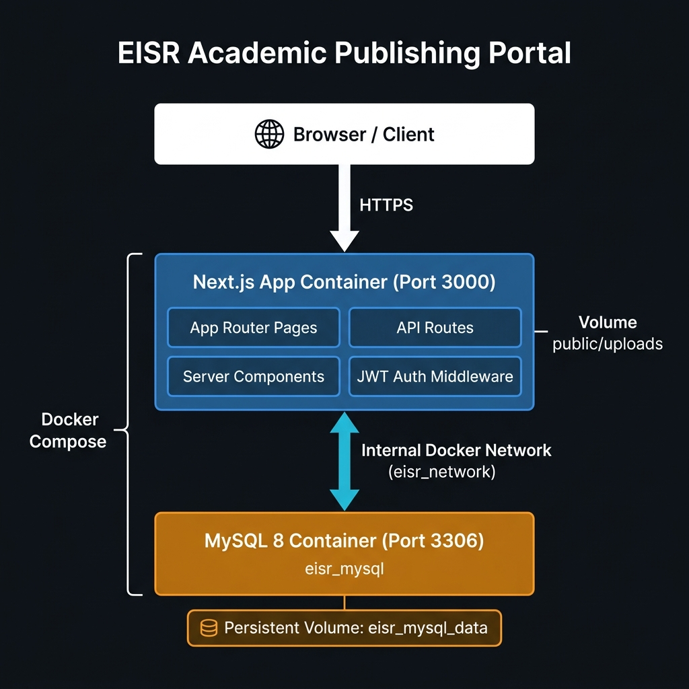
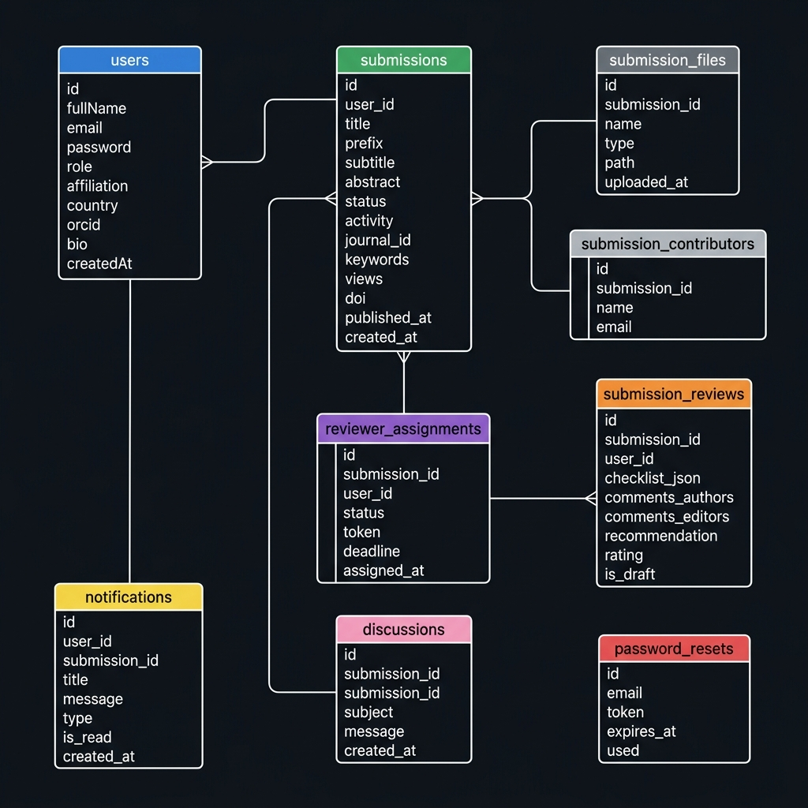
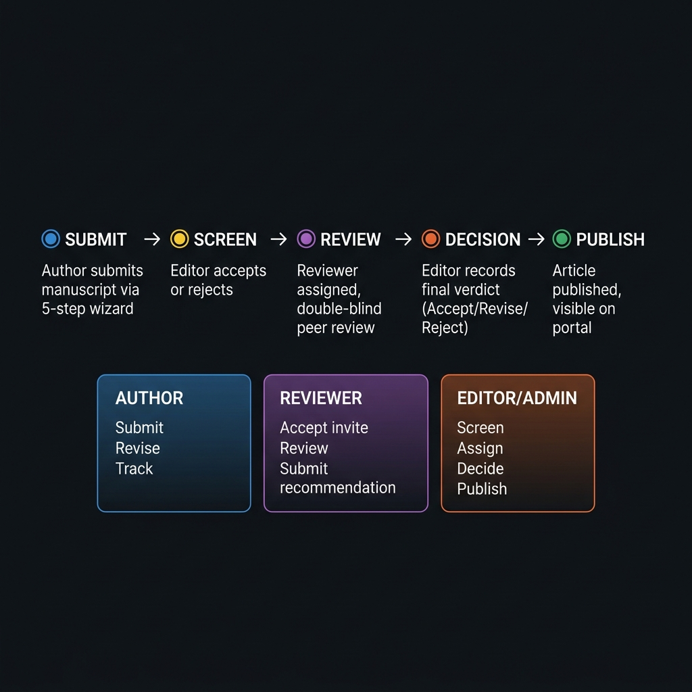

# EISR Publishing Portal (IPP)

<div align="center">


**Eye-Innovations Scientific Research — Academic Publishing Portal**

*A production-grade, state-of-the-art manuscript management & peer-review system*

[](https://nextjs.org)
[](https://react.dev)
[](https://mysql.com)
[](https://tailwindcss.com)
[](https://docker.com)
[](LICENSE)

[Portal Home](https://eye-isr.com) · [JEIML Journal](https://eye-isr.com/journals/jeiml) · [JEISA Journal](https://eye-isr.com/journals/jcsra)

</div>

---

## 📋 Table of Contents

- [Project Overview](#-project-overview)
- [Technology Stack](#-technology-stack)
- [System Architecture](#-system-architecture)
- [Directory Structure](#-directory-structure)
- [Database Schema](#-database-schema)
- [User Roles & Permissions](#-user-roles--permissions)
- [Manuscript Workflow](#-manuscript-workflow)
- [API Documentation](#-api-documentation)
- [Journals Configured](#-journals-configured)
- [Key Features](#-key-features)
- [Environment Variables](#-environment-variables)
- [Local Development Setup](#-local-development-setup)
- [Docker Production Deployment](#-docker-production-deployment)
- [Safe Redeployment (CRITICAL)](#-safe-redeployment-critical)
- [Emergency Data Restore](#-emergency-data-restore)
- [Email System](#-email-system)
- [File Upload System](#-file-upload-system)
- [Frontend Pages](#-frontend-pages)
- [Components Library](#-components-library)
- [Adding a New Journal](#-adding-a-new-journal)
- [Troubleshooting](#-troubleshooting)

---

## 🏢 Project Overview

The **EISR Publishing Portal (IPP)** is a full-stack, production-grade academic publishing platform built for **Eye-Innovations Scientific Research (EISR)**. It handles the complete lifecycle of scientific manuscripts — from submission to peer review, editorial decision, and final publication.

The system manages **multiple independent journals** from a single codebase, with each journal having its own branding, editorial team, policies, and article listings.

### What it does:
- Authors submit manuscripts through a guided multi-step wizard
- Editors screen, assign reviewers, and record final decisions
- Reviewers receive email invitations and submit structured review reports
- Published articles appear on public journal pages with DOI, views, and citation data
- Real-time notifications keep all parties informed at every step

---

## 🛠️ Technology Stack

| Layer | Technology | Version | Purpose |
|---|---|---|---|
| **Frontend** | Next.js App Router | 16.1.6 | SSR, routing, pages |
| **UI Framework** | React | 19.2.3 | Component rendering |
| **Styling** | TailwindCSS | 4.x | Utility-first CSS |
| **Icons** | Lucide React | 0.576.0 | UI icon library |
| **Animation** | Framer Motion | 12.x | Page/UI animations |
| **Backend** | Next.js API Routes | — | REST API endpoints |
| **Database** | MySQL | 8.0 | Relational data storage |
| **DB Client** | mysql2/promise | 3.x | Async MySQL connection pool |
| **Auth** | jsonwebtoken (JWT) | 9.x | Stateless authentication |
| **Encryption** | bcrypt | 6.x | Password hashing |
| **Email** | Nodemailer | 8.x | SMTP email delivery |
| **Fonts** | Google Fonts | — | Merriweather + Inter |
| **Containerization** | Docker + Docker Compose | — | Production deployment |
| **Build Tool** | Turbopack | — | Fast dev server |

---

## 🏗️ System Architecture



```
┌─────────────────────────────────────────────────────────────┐
│                      BROWSER / CLIENT                       │
└─────────────────────────────┬───────────────────────────────┘
                              │ HTTPS (Port 3000)
┌─────────────────────────────▼───────────────────────────────┐
│              Next.js App Container (eisr_portal)            │
│  ┌─────────────┐  ┌─────────────┐  ┌────────────────────┐  │
│  │  App Router │  │  API Routes │  │   JWT Middleware    │  │
│  │   Pages     │  │  /api/...   │  │   verifyUser()     │  │
│  └─────────────┘  └─────────────┘  └────────────────────┘  │
│                         ↕ mysql2/promise pool               │
│  Volume: ./public/uploads ←→ /app/public/uploads            │
└─────────────────────────────┬───────────────────────────────┘
                              │ Docker Network: eisr_network
┌─────────────────────────────▼───────────────────────────────┐
│              MySQL 8 Container (eisr_mysql)                  │
│                Port: 3306 (internal)                         │
│         Volume: eisr_mysql_data (PERSISTENT)                 │
│              Database: eisr_db5                              │
└─────────────────────────────────────────────────────────────┘
```

### Key Design Decisions:
- **Standalone Next.js output** (`output: 'standalone'`) — optimized Docker image
- **MySQL connection pool** — 10 concurrent connections, queue-based
- **JWT stateless auth** — no session storage needed, scalable
- **Named Docker volume** — MySQL data survives container restarts/rebuilds

---

## 📁 Directory Structure

```
EISR/                             ← Project root
├── src/
│   ├── app/                      ← Next.js App Router
│   │   ├── layout.js             ← Global layout (fonts, metadata, SEO)
│   │   ├── page.js               ← Homepage (hero, stats, journals, articles)
│   │   ├── globals.css           ← Global CSS
│   │   │
│   │   ├── api/                  ← All REST API endpoints
│   │   │   ├── articles/         ← GET published articles, by ID, view counter
│   │   │   │   ├── route.js      ← GET /api/articles?journal=jeiml
│   │   │   │   ├── [id]/
│   │   │   │   │   ├── route.js  ← GET /api/articles/:id
│   │   │   │   │   └── view/     ← POST /api/articles/:id/view (increment)
│   │   │   │   └── latest/       ← GET /api/articles/latest
│   │   │   ├── auth/             ← Authentication
│   │   │   │   ├── login/        ← POST /api/auth/login
│   │   │   │   ├── register/     ← POST /api/auth/register
│   │   │   │   ├── forgot-password/
│   │   │   │   └── reset-password/
│   │   │   ├── submissions/      ← Manuscript CRUD
│   │   │   │   ├── route.js      ← GET (by role), POST (create/update)
│   │   │   │   ├── [id]/         ← GET, PATCH, DELETE single submission
│   │   │   │   └── bulk-delete/  ← DELETE multiple submissions
│   │   │   ├── reviewer/
│   │   │   │   ├── assignments/  ← POST invite reviewer, GET assignments
│   │   │   │   └── reviews/      ← POST submit review, GET reviews
│   │   │   ├── review/           ← Public token-based review accept/decline
│   │   │   ├── notifications/    ← GET/PATCH user notifications
│   │   │   ├── profile/          ← GET/PATCH user profile
│   │   │   ├── stats/            ← GET portal statistics (public)
│   │   │   │   ├── route.js      ← GET /api/stats (global)
│   │   │   │   └── [journalId]/  ← GET /api/stats/:journalId
│   │   │   ├── upload/           ← POST file upload (manuscripts)
│   │   │   └── download/         ← GET file download (auth-protected)
│   │   │
│   │   ├── journals/             ← Public journal pages
│   │   │   ├── page.js           ← All journals listing
│   │   │   └── [slug]/           ← Dynamic journal pages
│   │   │       ├── page.js       ← Journal homepage (hero, stats, about)
│   │   │       ├── current-issue/← Published articles (DYNAMIC, DB-driven)
│   │   │       ├── archives/     ← Past issues
│   │   │       └── [section]/    ← Aims, Guidelines, Editorial Team, Policies...
│   │   │
│   │   ├── articles/             ← Public article pages
│   │   │   ├── page.js           ← All published articles (search, filter)
│   │   │   ├── ArticlesClient.js ← Client-side filter/sort component
│   │   │   └── [slug]/           ← Individual article detail page
│   │   │
│   │   ├── dashboard/            ← Protected user workspace
│   │   │   ├── layout.js         ← Dashboard shell (sidebar, auth guard)
│   │   │   ├── page.js           ← Dashboard home (role-aware)
│   │   │   ├── profile/          ← User profile management
│   │   │   ├── submit/           ← 5-step submission wizard
│   │   │   ├── submissions/      ← Submission management
│   │   │   │   ├── page.js
│   │   │   │   ├── _SubmissionsTable.js ← Shared table component
│   │   │   │   ├── [id]/         ← Individual submission detail
│   │   │   │   ├── all/          ← All submissions (editor view)
│   │   │   │   ├── unassigned/   ← Awaiting reviewer assignment
│   │   │   │   ├── in-review/    ← Under peer review
│   │   │   │   ├── accepted/     ← Editorially accepted
│   │   │   │   ├── declined/     ← Rejected submissions
│   │   │   │   ├── revisions-requested/ ← Awaiting author revision
│   │   │   │   ├── revisions-submitted/ ← Revision uploaded
│   │   │   │   ├── published/    ← Published articles
│   │   │   │   ├── scheduled/    ← Scheduled for future publish
│   │   │   │   ├── incomplete/   ← Draft submissions
│   │   │   │   └── editor/       ← Editor-specific queue
│   │   │   └── reviewer/         ← Reviewer workspace
│   │   │       ├── assignments/  ← Active assignments
│   │   │       ├── all/          ← All reviews history
│   │   │       ├── completed/    ← Completed reviews
│   │   │       ├── declined/     ← Declined invitations
│   │   │       ├── archived/     ← Archived reviews
│   │   │       ├── action-required/ ← Pending action
│   │   │       └── published/    ← Reviewed & published
│   │   │
│   │   ├── login/                ← Login page
│   │   ├── register/             ← Registration page
│   │   ├── forgot-password/      ← Password reset request
│   │   ├── reset-password/       ← Password reset (token-based)
│   │   ├── editors/              ← Public editorial board page
│   │   ├── leadership/           ← EISR leadership page
│   │   ├── indexing/             ← Indexing partners page
│   │   ├── apc/                  ← Article Processing Charges page
│   │   ├── contact/              ← Contact page
│   │   ├── privacy/              ← Privacy policy page
│   │   ├── policies/             ← Journal policies hub
│   │   └── submission/           ← Submission guidelines page
│   │
│   ├── components/               ← Reusable UI components
│   │   ├── Header.js             ← Global navigation header
│   │   ├── Footer.js             ← Global footer
│   │   ├── JournalHero.js        ← Journal banner with tabs
│   │   ├── Logo.js               ← EISR logo component
│   │   └── PolicyAccordion.js    ← Expandable policy sections
│   │
│   └── lib/                      ← Core utilities & configs
│       ├── db.js                 ← MySQL connection pool
│       ├── auth.js               ← JWT verify middleware
│       ├── data.js               ← Journals data, editorial teams (source of truth)
│       ├── mail.js               ← Nodemailer SMTP wrapper
│       ├── email-templates.js    ← All HTML email templates
│       ├── countries.js          ← Countries list for registration
│       └── utils.js              ← clsx + tailwind-merge utility
│
├── public/                       ← Static assets (served at /)
│   ├── logoEISR.png              ← Main EISR logo
│   ├── jeiml_cover_new.png       ← JEIML journal cover
│   ├── jeisa_cover_new.png       ← JEISA journal cover
│   ├── jeiml_header_logo.png     ← JEIML header logo
│   ├── jeisa_header_logo.png     ← JEISA header logo
│   ├── banner1-4.jpg             ← Homepage hero banners
│   ├── prof_irfan_uddin_uploaded.png ← JEIML Editor-in-Chief photo
│   ├── dr_nesren_uploaded.png    ← JEIML Managing Editor photo
│   ├── ali_kashif_bashir.png     ← JEISA Editor-in-Chief photo
│   ├── nadhem_ebrahim.png        ← JEISA Managing Editor photo
│   ├── JEIMT-Template.docx       ← JEIML manuscript template
│   ├── JEISA-Template.docx       ← JEISA manuscript template
│   └── uploads/                  ← Uploaded manuscript files (runtime)
│
├── mysql/
│   └── init/
│       └── schema.sql            ← Auto-runs on first Docker MySQL start
│
├── unUsed/                       ← Archive: old/debug code (not in production)
│
├── Dockerfile                    ← Multi-stage Docker build
├── docker-compose.yml            ← Docker services definition
├── deploy.sh                     ← ⭐ SAFE REDEPLOY SCRIPT (always use this!)
├── restore.sh                    ← Emergency database restore
├── .env                          ← Local env vars (never commit)
├── .env.example                  ← Template for .env setup
├── .gitignore                    ← Excludes .env, node_modules, uploads
├── next.config.mjs               ← Next.js config (standalone output)
├── package.json                  ← Dependencies
├── jsconfig.json                 ← Path aliases (@/ → src/)
├── tailwind.config.js            ← TailwindCSS v4 config
├── postcss.config.mjs            ← PostCSS config
└── eslint.config.mjs             ← ESLint config
```

---

## 🗄️ Database Schema



The database is named `eisr_db5` and contains 9 tables:

### `users`
Stores all portal users across all roles.

| Column | Type | Notes |
|---|---|---|
| `id` | INT AUTO_INCREMENT | Primary key |
| `fullName` | VARCHAR(255) | Full display name |
| `username` | VARCHAR(100) UNIQUE | Optional username |
| `email` | VARCHAR(255) UNIQUE | Login email |
| `password` | VARCHAR(255) | bcrypt hashed |
| `role` | VARCHAR(50) | `author`, `reviewer`, `editor`, `admin` |
| `givenName` | VARCHAR(100) | First name |
| `familyName` | VARCHAR(100) | Last name |
| `affiliation` | VARCHAR(255) | Institution |
| `country` | VARCHAR(100) | Country of residence |
| `mailingAddress` | TEXT | Postal address |
| `orcid` | VARCHAR(100) | ORCID identifier |
| `bio` | TEXT | Short biography |
| `phone` | VARCHAR(50) | Contact number |
| `createdAt` | TIMESTAMP | Registration date |

### `submissions`
Central table for all manuscripts.

| Column | Type | Notes |
|---|---|---|
| `id` | INT AUTO_INCREMENT | Primary key |
| `user_id` | INT | FK → users.id (submitting author) |
| `title` | TEXT | Manuscript title |
| `prefix` | VARCHAR(120) | Title prefix (Dr., Prof., etc.) |
| `subtitle` | TEXT | Optional subtitle |
| `abstract` | TEXT | Manuscript abstract |
| `status` | VARCHAR(50) | See status lifecycle below |
| `activity` | VARCHAR(100) | Current workflow activity |
| `journal_id` | VARCHAR(50) | `jeiml` or `jcsra` |
| `editor_comments` | TEXT | Private editor notes |
| `keywords` | TEXT | Comma-separated keywords |
| `references_list` | TEXT | References section |
| `final_file_path` | VARCHAR(512) | Path to final published file |
| `citations_scopus` | INT | Scopus citation count |
| `citations_google` | INT | Google Scholar citation count |
| `doi` | VARCHAR(255) | Digital Object Identifier |
| `views` | INT | View count (incremented on page load) |
| `scheduled_at` | DATETIME | Future publish date (if scheduled) |
| `published_at` | DATETIME | Actual publish timestamp |
| `created_at` | TIMESTAMP | Submission date |

**Submission Status Lifecycle:**
```
Incomplete → Submitted → Unassigned → In Review → Revisions Requested
     ↑                                                      ↓
  (Draft)                                           Revisions Submitted
                                                           ↓
                                          Accepted / Declined / Published / Scheduled
```

### `submission_files`
Files attached to a submission.

| Column | Type | Notes |
|---|---|---|
| `id` | INT | Primary key |
| `submission_id` | INT | FK → submissions.id |
| `name` | VARCHAR(255) | Original filename |
| `type` | VARCHAR(100) | e.g. "Article Text", "Supplementary" |
| `path` | VARCHAR(512) | File path under public/uploads/ |
| `uploaded_at` | TIMESTAMP | Upload timestamp |

### `submission_contributors`
Co-authors / contributors for a submission.

| Column | Type |
|---|---|
| `id` | INT |
| `submission_id` | INT |
| `name` | VARCHAR(255) |
| `email` | VARCHAR(255) |

### `reviewer_assignments`
Tracks reviewer invitations and their status.

| Column | Type | Notes |
|---|---|---|
| `id` | INT | Primary key |
| `submission_id` | INT | FK → submissions.id |
| `user_id` | INT | FK → users.id (reviewer) |
| `status` | VARCHAR(50) | `Pending`, `Accepted`, `Declined`, `Completed` |
| `token` | VARCHAR(512) | Unique one-time invite token |
| `deadline` | DATETIME | Response deadline |
| `response_deadline` | DATETIME | Accept/decline deadline |
| `review_deadline` | DATETIME | Review submission deadline |
| `assigned_at` | TIMESTAMP | Assignment date |

### `submission_reviews`
Actual review content submitted by reviewers.

| Column | Type | Notes |
|---|---|---|
| `id` | INT | Primary key |
| `submission_id` | INT | FK → submissions.id |
| `user_id` | INT | FK → users.id (reviewer) |
| `checklist_json` | TEXT | Review checklist answers (JSON) |
| `comments_authors` | TEXT | Comments visible to authors |
| `comments_editors` | TEXT | Private comments to editors |
| `recommendation` | VARCHAR(50) | Accept / Minor Revision / Major Revision / Reject |
| `rating` | INT | Overall manuscript rating |
| `file_url` | VARCHAR(512) | Annotated file upload path |
| `is_draft` | TINYINT(1) | 1 = draft, 0 = submitted |
| `created_at` / `updated_at` | TIMESTAMP | Timestamps |

### `notifications`
In-portal notification system.

| Column | Type |
|---|---|
| `id` | INT |
| `user_id` | INT |
| `submission_id` | INT |
| `title` | VARCHAR(255) |
| `message` | TEXT |
| `type` | VARCHAR(100) |
| `is_read` | TINYINT(1) |
| `created_at` | TIMESTAMP |

### `discussions`
Editor-author message threads per submission.

| Column | Type |
|---|---|
| `id` | INT |
| `subject` | VARCHAR(255) |
| `submission_id` | INT |
| `user_id` | INT |
| `message` | TEXT |
| `created_at` | TIMESTAMP |

### `password_resets`
Secure password reset tokens.

| Column | Type |
|---|---|
| `id` | INT |
| `email` | VARCHAR(255) |
| `token` | VARCHAR(512) |
| `expires_at` | DATETIME |
| `used` | TINYINT(1) |
| `created_at` | TIMESTAMP |

---

## 👥 User Roles & Permissions

| Permission | Author | Reviewer | Editor | Admin |
|---|:---:|:---:|:---:|:---:|
| Submit manuscripts | ✅ | — | — | ✅ |
| View own submissions | ✅ | — | — | ✅ |
| Accept/Decline review invitations | — | ✅ | — | ✅ |
| Submit review reports | — | ✅ | — | ✅ |
| View all submissions | — | — | ✅ | ✅ |
| Assign reviewers | — | — | ✅ | ✅ |
| Record editorial decisions | — | — | ✅ | ✅ |
| Publish articles | — | — | ✅ | ✅ |
| Schedule publications | — | — | ✅ | ✅ |
| Manage all users | — | — | — | ✅ |
| Bulk delete submissions | — | — | ✅ | ✅ |

> **Role is set in the `users.role` column in the database.**
> Roles: `author` (default), `reviewer`, `editor`, `admin`

---

## 📝 Manuscript Workflow



### ✍️ Author Path
1. Register / Login → Go to Dashboard
2. Click **Submit Manuscript** → 5-step wizard:
   - Step 1: Select journal, enter title, abstract, keywords
   - Step 2: Upload manuscript file (PDF/DOCX)
   - Step 3: Add co-authors/contributors
   - Step 4: Add cover letter / comments for editor
   - Step 5: Review & Submit
3. Receive email confirmation with submission ID
4. Track status in dashboard (`Submitted → Unassigned → In Review → Decision`)
5. If revisions requested → upload revised file
6. Once accepted → article moves to Published status

### 🧐 Reviewer Path
1. Editor sends invitation email with secure one-click links
2. Reviewer clicks **Accept** or **Decline** link (no login needed!)
3. If accepted → log in → go to Reviewer Dashboard
4. View abstract + download manuscript
5. Fill 4-part review form:
   - Review checklist
   - Comments for authors
   - Private comments for editors
   - Recommendation + rating
6. Upload annotated file (optional)
7. Submit → Editor is notified

### ⚖️ Editor/Admin Path
1. New submission arrives → email notification + portal notification
2. Initial screening → Accept (move to Unassigned) or Reject
3. Search reviewer pool → send invitations
4. Monitor review progress
5. Once reviews received → read all feedback
6. Record final decision: Accept / Request Revision / Reject
7. If accepted → Upload final file → Set Publish or Schedule date
8. Article appears on public journal Current Issue page

---

## 🔌 API Documentation

All API routes are under `/api/`. Protected routes require `Authorization: Bearer <jwt_token>` header.

### Auth APIs

| Endpoint | Method | Auth | Body | Response |
|---|---|---|---|---|
| `/api/auth/login` | POST | Public | `{email, password}` | `{success, token, user}` |
| `/api/auth/register` | POST | Public | `{fullName, email, password, ...}` | `{success, token, user}` |
| `/api/auth/forgot-password` | POST | Public | `{email}` | `{success, message}` |
| `/api/auth/reset-password` | POST | Public | `{token, password}` | `{success, message}` |

### Article APIs (Public)

| Endpoint | Method | Auth | Query/Params | Response |
|---|---|---|---|---|
| `/api/articles` | GET | Public | `?journal=jeiml` | `{success, articles[]}` |
| `/api/articles/:id` | GET | Public | `:id` = submission ID | `{success, article}` |
| `/api/articles/:id/view` | POST | Public | `:id` | Increments view count |
| `/api/articles/latest` | GET | Public | — | Latest published articles |

### Submission APIs (Auth Required)

| Endpoint | Method | Auth | Notes |
|---|---|---|---|
| `/api/submissions` | GET | ✅ | Role-aware: author sees own, editor sees all |
| `/api/submissions` | POST | ✅ | Create new submission or update draft |
| `/api/submissions/:id` | GET | ✅ | Full detail with files, contributors |
| `/api/submissions/:id` | PATCH | ✅ | Update status, schedule, editor comments |
| `/api/submissions/:id` | DELETE | ✅ | Delete single submission |
| `/api/submissions/bulk-delete` | DELETE | ✅ Editor/Admin | Delete multiple by IDs |

**PATCH body examples:**
```json
// Change status
{ "status": "Published", "publishedAt": "2026-05-25T00:00:00Z" }

// Schedule publication
{ "status": "Scheduled", "scheduledAt": "2026-06-01T00:00:00Z" }

// Record decision with editor comments
{ "status": "Declined", "editorComments": "Does not meet scope." }
```

### Reviewer APIs (Auth Required)

| Endpoint | Method | Auth | Notes |
|---|---|---|---|
| `/api/reviewer/assignments` | POST | ✅ Editor | Invite reviewer, send email |
| `/api/reviewer/assignments` | GET | ✅ | Get assignments for current user |
| `/api/reviewer/reviews` | GET | ✅ | Get reviews for a submission |
| `/api/reviewer/reviews` | POST | ✅ Reviewer | Submit/save review (draft or final) |
| `/api/review` | GET | Public | Token-based accept/decline (from email link) |

### Other APIs

| Endpoint | Method | Auth | Notes |
|---|---|---|---|
| `/api/stats` | GET | Public | Global portal stats (articles, views, journals) |
| `/api/stats/:journalId` | GET | Public | Per-journal stats |
| `/api/upload` | POST | ✅ | Upload manuscript file, returns file path |
| `/api/download` | GET | ✅ | Download uploaded file |
| `/api/notifications` | GET | ✅ | Get user notifications |
| `/api/notifications` | PATCH | ✅ | Mark notification as read |
| `/api/profile` | GET | ✅ | Get current user profile |
| `/api/profile` | PATCH | ✅ | Update user profile |

> **Removed from production (moved to `unUsed/`):**
> `/api/debug/reviewer`, `/api/test-db`, `/api/setup` — these were development-only routes.

---

## 📰 Journals Configured

Configured in [`src/lib/data.js`](src/lib/data.js). All journal data is static (no DB table for journals).

### 1. JEIML — Journal of Eye-Innovation in Machine Learning
- **Slug/ID:** `jeiml`
- **Editor-in-Chief:** Prof. Dr. M. Irfan Uddin (University of Swabi, Pakistan)
- **Managing Editor:** Dr. Nesren S. Farhah (Saudi Electronic University)
- **Focus Areas:** ML, AI, Deep Learning, Computer Vision, NLP, XAI
- **APC:** No Charge
- **Review:** Double-Blind
- **Indexing:** Crossref, Google Scholar
- **Contact:** JEIML@EISRpress.com

### 2. JEISA — Journal of Eye Innovation in Security Analysis
- **Slug/ID:** `jcsra` (URL slug uses `jcsra`)
- **Editor-in-Chief:** Prof. Ali Kashif Bashir (Manchester Metropolitan University)
- **Managing Editor:** Dr. Nadhem Ebrahim (University of Akron)
- **Focus Areas:** Cybersecurity, Network Security, Digital Forensics, Cryptography
- **APC:** No Charge
- **Review:** Double-Blind
- **Indexing:** Crossref, Google Scholar
- **Contact:** JEISA@EISRpress.com

---

## ✨ Key Features

### Multi-Journal Support
Single codebase manages multiple journals. Each journal has independent:
- Editorial team
- Scope & aims
- Policies (ethics, plagiarism, open access, copyright, etc.)
- Branding (cover image, logo, colors)
- Article listings

### 5-Step Submission Wizard
Authors guided through structured manuscript submission with validation at each step. Supports draft saving (Incomplete status) and final submission.

### Double-Blind Peer Review
- Reviewer identities hidden from authors
- Author identities hidden from reviewers
- Token-based email invitations (one-click accept/decline, no login needed)
- Ghost accounts created automatically for non-registered reviewers

### Real-Time Notifications
- Portal notification bell (unread count)
- Email notifications for every status change
- Rich HTML email templates via Nodemailer

### Scheduled Publishing
Editor can set a future publish date. Articles with `status=Scheduled` and `scheduled_at <= NOW()` are automatically treated as Published by the API.

### View Counter
Every public article page load triggers `POST /api/articles/:id/view` which increments the `views` column.

### DOI Support
Published articles get a DOI. If no DOI is set in DB, the system auto-generates:
```
https://doi.org/10.63180/{journal_id}.eisr.{year}.1.{article_id}
```

### File Upload System
Manuscripts uploaded via `POST /api/upload`. Files saved to `public/uploads/` with sanitized, unique filenames. Volume-mounted in Docker for persistence.

---

## 🔐 Environment Variables

Create `.env` file in project root (copy from `.env.example`):

```env
# ── App Settings ─────────────────────────────
NODE_ENV=production
NEXT_PUBLIC_APP_URL=https://your-domain.com   # Used in email links

# ── JWT Authentication ────────────────────────
# MUST be 64+ random characters. Never expose publicly.
# Generate: node -e "console.log(require('crypto').randomBytes(64).toString('hex'))"
JWT_SECRET=your_64_char_random_string_here

# ── MySQL Database ────────────────────────────
MYSQL_HOST=db              # Use 'db' for Docker, '127.0.0.1' for local dev
MYSQL_PORT=3306
MYSQL_USER=eisr_user
MYSQL_PASSWORD=your_db_password
MYSQL_DATABASE=eisr_db5

# Only needed for Docker Compose (root password for MySQL container)
MYSQL_ROOT_PASSWORD=your_root_password

# ── Email (SMTP) ──────────────────────────────
# Leave blank to skip emails (dev mode — reset links shown on screen)
SMTP_HOST=smtp.gmail.com
SMTP_PORT=587
SMTP_SECURE=false
SMTP_USER=your-email@gmail.com
SMTP_PASS=your-gmail-app-password   # Use Gmail App Password, not regular password
```

> ⚠️ **NEVER commit `.env` to git.** It is in `.gitignore`.

---

## 💻 Local Development Setup

**Requirements:** Node.js v18+, MySQL 8.0+

```bash
# 1. Clone the repository
git clone https://github.com/eyeisr/EISR.git
cd EISR

# 2. Install dependencies
npm install

# 3. Create .env file
cp .env.example .env
# Edit .env with your local MySQL credentials

# 4. Create database in MySQL
mysql -u root -p
> CREATE DATABASE eisr_db5;
> EXIT;

# 5. Start development server
npm run dev
# → http://localhost:3000

# 6. Initialize database tables (run once)
# mysql -u root -p eisr_db5 < mysql/init/schema.sql
```

### Available Scripts

| Command | Description |
|---|---|
| `npm run dev` | Start development server (Turbopack, hot reload) |
| `npm run build` | Build production bundle |
| `npm run start` | Start production server |
| `npm run lint` | Run ESLint |

---

## 🐳 Docker Production Deployment

### First Time Setup (Run Once)

```bash
# 1. SSH into your server
ssh user@your-server-ip

# 2. Clone the repository
git clone https://github.com/eyeisr/EISR.git
cd EISR

# 3. Create .env file
cp .env.example .env
nano .env
# Fill in all values (MYSQL_HOST=db, production credentials, etc.)

# 4. Start all containers
docker compose up -d --build

# Wait 30-60 seconds for everything to start...

# 5. Verify containers are running
docker ps
# Should see: eisr_production_portal + eisr_mysql

# 6. Check logs
docker logs eisr_production_portal
docker logs eisr_mysql

# 7. Test the app
curl http://localhost:3000
```

The `mysql/init/schema.sql` file auto-runs on first MySQL container start, creating all tables.

### Docker Container Details

| Container | Image | Port | Volume |
|---|---|---|---|
| `eisr_production_portal` | Custom (Dockerfile) | 3000:3000 | `./public/uploads:/app/public/uploads` |
| `eisr_mysql` | mysql:8.0 | 3306:3306 | `eisr_mysql_data:/var/lib/mysql` |

---

## ⚠️ Safe Redeployment (CRITICAL — READ THIS!)

> **This is the most important section for anyone maintaining this server.**

### ❌ NEVER RUN THIS COMMAND

```bash
docker compose down -v   # -v FLAG DESTROYS THE DATABASE VOLUME!
```

This deletes **all data permanently** — articles, users, everything. There is no undo.

### ✅ ALWAYS USE THIS INSTEAD

```bash
bash deploy.sh
```

### What `deploy.sh` does automatically:

1. 🔒 **Takes database backup** → saved to `./backups/eisr_db5_backup_TIMESTAMP.sql`
2. 📥 **Pulls latest code** → `git pull origin main`
3. 🏗️ **Rebuilds ONLY the app container** → database container is never touched
4. ✅ **Verifies the app is running**

```bash
# Example usage on server after every bug fix or update:
ssh user@your-server
cd /path/to/EISR
bash deploy.sh
```

### Step-by-step safe workflow for every update:

```
Developer fixes bug locally
         ↓
git push origin main
         ↓
SSH into production server
         ↓
cd /path/to/EISR
bash deploy.sh        ← ONLY THIS COMMAND NEEDED
         ↓
Done ✅ — data safe, app updated
```

---

## 🆘 Emergency Data Restore

If data was accidentally deleted, restore from backup:

```bash
# List available backups
ls -lh ./backups/

# Restore from a specific backup file
bash restore.sh ./backups/eisr_db_backup_20260525_120000.sql
```

### Manual backup at any time:
```bash
docker exec eisr_mysql mysqldump \
  -u root -p${MYSQL_ROOT_PASSWORD} \
  ${MYSQL_DATABASE} > ./backups/manual_backup_$(date +%Y%m%d_%H%M%S).sql
```

---

## 📧 Email System

Emails are sent via Nodemailer using SMTP. All templates are in [`src/lib/email-templates.js`](src/lib/email-templates.js).

### Emails sent automatically:

| Trigger | Recipients | Template |
|---|---|---|
| New submission | Author + All Editors | Submission confirmation |
| Reviewer invitation | Reviewer | Invite with Accept/Decline links |
| Editorial decision | Author | Decision notification |
| Revision request | Author | Revision request with comments |
| Password reset | User | Reset link (expires in 1 hour) |
| Review submitted | Editor | Review ready notification |

### Gmail App Password Setup (Recommended):
1. Go to https://myaccount.google.com/apppasswords
2. Create new App Password for "Mail"
3. Copy the 16-character password to `SMTP_PASS` in `.env`

> If `SMTP_USER` / `SMTP_PASS` are blank, emails are skipped silently (dev mode).

---

## 📁 File Upload System

Manuscripts are uploaded via `POST /api/upload` (auth required).

- **Storage location:** `public/uploads/` (server filesystem)
- **Docker volume:** `./public/uploads:/app/public/uploads` (persists across rebuilds)
- **File naming:** Sanitized + unique timestamp prefix to prevent collisions
- **Supported formats:** PDF, DOCX (recommended)
- **Download:** `GET /api/download?file=filename` (auth required)

> ⚠️ The `public/uploads/` directory is **NOT in git** (in `.gitignore`). It must exist on the server and be writable.

---

## 🖥️ Frontend Pages

| URL | Page | Auth |
|---|---|---|
| `/` | Homepage (hero, live stats, journals, latest articles) | Public |
| `/journals` | All journals listing | Public |
| `/journals/jeiml` | JEIML journal homepage | Public |
| `/journals/jeiml/current-issue` | Published JEIML articles (DB-driven) | Public |
| `/journals/jeiml/archives` | JEIML past issues | Public |
| `/journals/jeiml/[section]` | Aims, Guidelines, Editorial Team, Policies... | Public |
| `/journals/jcsra` | JEISA journal homepage | Public |
| `/articles` | All published articles (search + filter) | Public |
| `/articles/:id` | Individual article detail page | Public |
| `/login` | Login form | Public |
| `/register` | Registration form | Public |
| `/forgot-password` | Request password reset | Public |
| `/reset-password` | Set new password (token-based) | Public |
| `/dashboard` | User dashboard (role-aware home) | ✅ Auth |
| `/dashboard/submit` | 5-step manuscript submission wizard | ✅ Auth |
| `/dashboard/submissions` | My submissions list | ✅ Auth |
| `/dashboard/submissions/:id` | Submission detail + editor panel | ✅ Auth |
| `/dashboard/submissions/all` | All submissions (editor view) | ✅ Editor |
| `/dashboard/submissions/unassigned` | Awaiting reviewer | ✅ Editor |
| `/dashboard/submissions/in-review` | Under review | ✅ Editor |
| `/dashboard/submissions/accepted` | Accepted manuscripts | ✅ Editor |
| `/dashboard/submissions/published` | Published articles | ✅ Editor |
| `/dashboard/reviewer/assignments` | Active review assignments | ✅ Reviewer |
| `/dashboard/reviewer/completed` | Completed reviews | ✅ Reviewer |
| `/dashboard/profile` | User profile management | ✅ Auth |
| `/editors` | Public editorial board page | Public |
| `/leadership` | EISR leadership team | Public |
| `/indexing` | Indexing partners | Public |
| `/apc` | Article Processing Charges | Public |
| `/contact` | Contact form | Public |
| `/policies` | Journal policies hub | Public |

---

## 🧩 Components Library

Located in `src/components/`:

### `Header.js`
Global navigation bar with:
- EISR logo
- Journals dropdown menu
- Articles link
- Login / Register / Dashboard buttons
- Mobile-responsive hamburger menu
- Notification bell (authenticated users)

### `Footer.js`
Global footer with:
- EISR branding
- Journal links
- Social media links
- Copyright

### `JournalHero.js`
Journal banner component used on all journal sub-pages:
- Background image
- Journal title, ISSN, editor-in-chief
- Navigation tabs: Home | Archives | Current Issue | Submit | Journal Menu | About

### `Logo.js`
EISR logo component (SVG-based, used in Header/Footer)

### `PolicyAccordion.js`
Expandable accordion for journal policy sections using Tailwind + clsx utilities

---

## ➕ Adding a New Journal

1. **Open** `src/lib/data.js`
2. **Add** a new object to the `journals` array with:
   ```js
   {
     id: 'journal-id',        // Used as journal_id in submissions
     slug: 'journal-slug',    // Used in URL: /journals/journal-slug
     acronym: 'JXXX',
     title: 'Full Journal Title',
     chief: 'Editor Name',
     // ... all other fields (see existing journals as template)
   }
   ```
3. **Add** journal cover & logo images to `public/`
4. **Update** `data.js` with editorial team members
5. The system automatically generates all journal pages (current-issue, archives, all policy pages, etc.)

> No database changes needed for adding a journal — it's all in `data.js`.

---

## 🔧 Troubleshooting

### App not starting after deploy
```bash
docker logs eisr_production_portal
# Look for error messages
```

### Database connection error
```bash
# Check MySQL is running
docker ps | grep eisr_mysql

# Check MySQL logs
docker logs eisr_mysql

# Test connection manually
docker exec -it eisr_mysql mysql -u root -p${MYSQL_ROOT_PASSWORD} -e "USE eisr_db; SHOW TABLES;"
```

### File uploads not saving
```bash
# Check uploads directory permissions
docker exec eisr_production_portal ls -la /app/public/uploads
# Should be writable by the nextjs user

# If missing, create it
docker exec eisr_production_portal mkdir -p /app/public/uploads
docker exec eisr_production_portal chmod 777 /app/public/uploads
```

### Email not sending
- Check `SMTP_USER` and `SMTP_PASS` are correctly set in `.env`
- For Gmail, use App Password (not your account password)
- Test SMTP in console: check logs for `Nodemailer error`
- If blank, emails silently skip (no error)

### JWT Auth errors (`401 Unauthorized`)
- Token might be expired (default: no expiry set, check `auth.js`)
- Wrong `JWT_SECRET` in `.env`
- User not passing `Authorization: Bearer <token>` header

### "Table doesn't exist" error
- Database schema not initialized
- Run: `mysql -u root -p${MYSQL_ROOT_PASSWORD} eisr_db < mysql/init/schema.sql`

### Submissions not showing on Current Issue page
- Article `status` must be exactly `Published` or `Scheduled`
- `scheduled_at` must be `<= NOW()` or `NULL`
- Check API: `curl http://localhost:3000/api/articles?journal=jeiml`

---

## 📊 Live Statistics

The homepage and journal pages show live stats from the database:

| Stat | Source | API |
|---|---|---|
| Published Articles | COUNT(submissions WHERE status=Published) | `/api/stats` |
| Total Views | SUM(submissions.views) | `/api/stats` |
| Total Journals | journals array length (data.js) | `/api/stats` |
| Per-journal articles/views/acceptance | DB queries per journal | `/api/stats/:journalId` |

---

## 📦 Production Checklist

Before final handover to client, verify:

- [ ] `.env` has all real production values
- [ ] `NEXT_PUBLIC_APP_URL` points to actual domain
- [ ] `JWT_SECRET` is strong and random (64+ chars)
- [ ] MySQL credentials are secure (not default passwords)
- [ ] `SMTP_USER` and `SMTP_PASS` configured for real email delivery
- [ ] `public/uploads/` directory is writable
- [ ] Docker containers both running: `docker ps`
- [ ] Homepage loads: `curl http://localhost:3000`
- [ ] `deploy.sh` tested and working
- [ ] First backup taken and verified

---

## 🔒 Security Notes

- Passwords hashed with **bcrypt** (cost factor 10+)
- JWT tokens stored client-side in `localStorage`
- API routes verify JWT on every request via `verifyRequestUser()`
- File downloads require authentication
- Review invite tokens are one-time-use, randomly generated
- No debug/test endpoints in production (moved to `unUsed/`)

---

## 📄 License

Proprietary — © 2026 **Eye-Innovations Scientific Research (EISR)**.
All rights reserved. Developed exclusively for EISR by the development team.

---

<div align="center">

**Developed with excellence for the global research community.**

*Eye-Innovations Scientific Research (EISR) — Advancing Knowledge Through Innovation*

</div>
